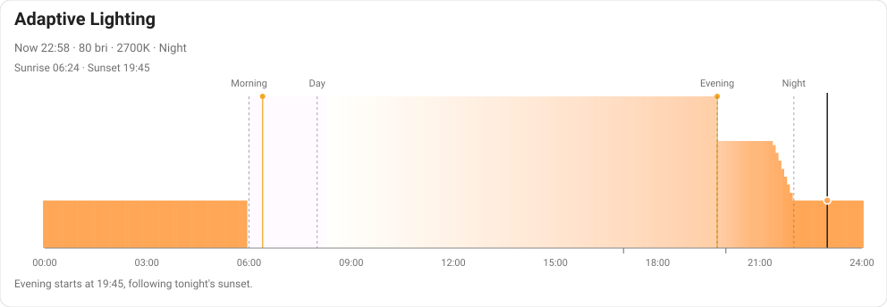

# Adaptive Lighting

Two independent pieces, designed to work together but not coupled to each other:

- **Adaptive Lighting Helpers** — a standalone Home Assistant integration exposing brightness/colour-temperature
  curve math and per-light grouping (reachability, tolerance, manual-override protection, two-step transitions,
  optional RGB colour) as plain HA services. Useful in your own automations even if you never touch the blueprint
  below.
- **The Adaptive Lighting blueprint** — a per-room automation built on top of those services: brightness and
  colour temperature follow a four-phase daily schedule, motion controls on/off, scenes can take over partially
  or entirely, manual changes are respected, and lights that don't reach their target get corrected automatically.



## Why four phases, not a continuous curve

Most "adaptive lighting" tools compute one continuous curve straight from the sun's position — brightness and
colour temperature interpolated smoothly between sunrise and sunset, nothing else to it. That's a reasonable
default, but it treats every part of your day the same way: just "more or less light," rather than light with a
*purpose*. This project instead uses four named phases — Morning, Day, Evening, Night — each justified on its own
terms, not just given its own numbers on a curve:

- **Morning** exists to help you wake up, not to track sunrise. It starts at a fixed time before you'd normally
  be up, independent of the season — a sun-tracking curve would have it arrive at 5am in June and 8am in
  December, which isn't what a wake-up light is for. Bright, cool-white light in the morning has been linked to
  better alertness later in the day: [one study](https://pubmed.ncbi.nlm.nih.gov/36058557/) found office workers
  given 1.5 hours of bright morning light for a week had higher sleep efficiency and less morning sleepiness than
  under regular office lighting.
- **Day** is the long middle stretch, gradually warming as it runs toward evening so the eventual transition
  doesn't feel abrupt.
- **Evening** is when relaxed, warm lighting takes over — the one phase that *does* track the sun (sunset), so
  your indoor lighting shifts in step with what's actually happening outside. It's clamped between an earliest
  and latest bound, though, so a 4pm winter sunset doesn't dump you into "relaxed evening" mode the moment you
  walk in from work, and a 10pm midsummer sunset doesn't mean evening never really arrives.
- **Night** isn't tied to any solar event at all — it's just what the house should look like once everyone's
  asleep: dim and warm, the lighting you want on at 3am without waking yourself up further.

Each boundary is independently configurable, each phase's brightness/colour temperature is too, and any phase
can be pinned manually when you want to override the schedule for a while. You can also run any number of these
schedules at once, each with its own name and settings — see
[docs/HELPERS.md](docs/HELPERS.md#optional-day-phasecurve-sensors).

## Adaptive Lighting Helpers (the integration)

Exposes the phase schedule above, plus per-light grouping (reachability, tolerance, manual-override protection,
two-step transitions, optional RGB colour) and scene-coverage gap filling, as four plain HA services —
`compute_lighting_groups` and `compute_curve` are pure planners that hand back data; `apply_lighting` wraps the
same grouping logic and actually turns lights on/off for you; `compute_scene_coverage` is the scene-handoff
helper. All usable from your own automations with no blueprint required. Can optionally run the schedule
continuously as sensors instead of calling `compute_curve` yourself. Full service contracts, YAML examples, and
the sensor/entity list: **[docs/HELPERS.md](docs/HELPERS.md)**.

## Bring your own sensor

`apply_lighting` and `compute_lighting_groups` don't require this integration's own `sensor.adaptive_lighting` —
they'll read brightness/colour targets off any sensor entity that exposes the right attributes. That's the whole
contract, and nothing else about the entity matters (its `state` is never read):

| Attribute | Type | Required |
|---|---|---|
| `brightness` | 0-255 | yes |
| `color_temp` | Kelvin | yes |
| `rgb_color` | `[r, g, b]` | no — only needed if you're using `prefer_rgb_color` |

A minimal hand-written template sensor satisfying that contract:

```yaml
template:
  - sensor:
      - name: "My Room's Adaptive Lighting"
        state: "{{ 'Evening' if now().hour >= 18 else 'Day' }}" # anything - not read by these services
        attributes:
          brightness: "{{ 180 if now().hour >= 18 else 255 }}"
          color_temp: "{{ 3200 if now().hour >= 18 else 5500 }}"
          # Optional - only needed for prefer_rgb_color
          rgb_color: "{{ [255, 200, 150] if now().hour >= 18 else [255, 255, 255] }}"
```

Point `apply_lighting`'s `sensor_entity_id` (or the blueprint's Adaptive Lighting Sensor input) at that entity
and everything else — reachability, tolerance, manual-override protection, two-step transitions, RGB dispatch —
works exactly the same as with this integration's own sensor.

## The blueprint

A per-room automation built on the services above (loosely coupled — it calls `apply_lighting` the same way it
calls `light.turn_on`, without assuming anything about how that service is implemented). Brightness and
colour temperature follow the phase schedule, motion controls on/off, scenes can take over partially or entirely,
manual changes are respected, and lights that don't reach their target get corrected automatically. Full
feature-by-feature breakdown and the input reference: **[docs/BLUEPRINT.md](docs/BLUEPRINT.md)**.

## Repository layout

```
custom_components/adaptive_lighting_helpers/
    __init__.py    registers the four services against real HA state
    coordinator.py shared schedule computation behind the sensors/select
                   below - one instance per sensor added via the
                   integration's "Add Sensor" flow
    sensor.py      day-phase/curve sensors (see docs/HELPERS.md)
    select.py      phase-override select (same doc)
    number.py      brightness/colour-temperature curve config, as
                   entities (same doc)
    time.py        schedule boundary times, as entities (same doc)
    switch.py      sticky-phase-override toggle, as an entity (same doc)
    curve.py       brightness/colour-temperature schedule + Kelvin -> RGB
    grouping.py    reachability, multiplier bucketing, tolerance checks,
                   manual-override protection, two-step/combined and
                   RGB-vs-colour-temp routing
    scenes.py      scene-coverage gap filling (apply a scene, then a
                   default for whatever it doesn't cover)
    manifest.json, config_flow.py, services.yaml, strings.json,
    translations/  standard HA integration/HACS scaffolding
    curve.py, grouping.py, and scenes.py are pure Python, no Home
    Assistant dependency - testable directly, and usable from anywhere
    that wants the math without the HA service/sensor wrapper around
    it. __init__.py, coordinator.py, sensor.py, select.py, number.py,
    time.py, and switch.py are the only files that touch `hass`.

hacs.json
    HACS repository metadata for the integration.

brand/
    generate_icon.py  renders brand/icon.svg from the real curve module
                      (same pattern as the dashboard preview generators):
                      the icon is the day's actual brightness/colour
                      curve as bars, with a sun in the evening gap
    icon.svg, icon.png, icon@2x.png
                      the integration's icon, sized (256/512, alpha) for
                      a home-assistant/brands submission - HA and HACS
                      only show integration icons served from that repo,
                      so the icon appears in the UI once it's submitted
                      there (custom_integrations/adaptive_lighting_helpers/)

blueprints/automation/danspencer/adaptive_lighting.yaml
    The automation blueprint: triggers, conditions, target resolution,
    and the action sequence (which service to call, with what target).
    Deliberately named differently from any prior "Adaptive Lighting
    Unified" blueprint so the two can run side by side while rooms are
    migrated over individually, rather than one replacing the other
    in place.

www/adaptive-lighting-curve-card.js
    Custom Lovelace card rendering the day's curve as a rendered-colour
    chart, with a live "now" marker.

dashboard/
    house-settings-card.yaml   card config to add to a view
    preview.html                renders the real card against synthetic
                                 data, no Home Assistant instance needed
    generate_preview_data.py    generates that synthetic data
    render_preview_svg.py       renders the screenshot above as a
                                 standalone SVG

tests/
    pytest suite for curve.py, grouping.py, and scenes.py.

docs/
    HELPERS.md     full service/sensor reference for the integration
    BLUEPRINT.md   full feature/input reference for the blueprint
```

Triggers, conditions, and target resolution stay in the blueprint; Home Assistant `condition:` blocks can't call
a service, so anything a condition depends on has to remain template-based. Multiplier bucketing, tolerance
checks, and transition routing are implemented in the integration and unit tested. See `CLAUDE.md` for further
implementation notes, including the (fairly involved) history of getting a custom integration to load correctly
at all.

## Installation

### Adaptive Lighting Helpers

Not yet published to the HACS default store. Add this repository as a HACS custom repository (HACS → the "⋮"
menu → Custom repositories → this repo's URL, category "Integration"), install, restart Home Assistant (a brand
new `custom_components` entry needs a restart to be discovered, not just a reload), then add it once via
Settings → Devices & Services → Add Integration → "Adaptive Lighting Helpers" — nothing to configure, this just
registers the services above. Add day-phase/curve sensors afterwards, any number of them, from the integration's
own page (Add Sensor) — see [docs/HELPERS.md](docs/HELPERS.md).

For local testing before it's on HACS at all, `scripts/link_into_ha.sh` copies
`custom_components/adaptive_lighting_helpers/` directly onto an HA host over SSH — see the script's own header
comment for details and why it copies rather than symlinks.

### The blueprint

Import directly via Home Assistant's own blueprint importer (Settings → Automations & Scenes → Blueprints →
Import Blueprint, paste this repo's raw URL to
`blueprints/automation/danspencer/adaptive_lighting.yaml`) — this is a plain HA feature, not something HACS is
involved in. Requires Adaptive Lighting Helpers to be installed first, since the blueprint calls its
`apply_lighting` service.

Note: if migrating from an older, pre-rewrite version of this blueprint, the inputs have changed
(`scene_sensor`/`scene_name_prefix` → `scene_template`/`extra_triggers`) — every room automation using the old
inputs will show as misconfigured until updated. Worth doing deliberately, room by room, rather than all at once.

Once imported, add an automation using the "Adaptive Lighting" blueprint per room — see
[docs/BLUEPRINT.md](docs/BLUEPRINT.md) for the full input reference.

### The dashboard card

Register `www/adaptive-lighting-curve-card.js` as a Lovelace resource (Settings → Dashboards → Resources → Add
Resource, URL `/local/adaptive-lighting-curve-card.js`, type JavaScript Module) and add the card config from
`dashboard/house-settings-card.yaml` to a view. By default the card reads the auto-seeded "Default" sensor's
entities; point it at any other named sensor with `sensor: <slugified name>` (e.g. `sensor: living_room`) in the
card config. Not currently HACS-distributed either (see CLAUDE.md's "Open
question" section for the plan to make it a proper HACS frontend plugin).

## Previewing the dashboard card

```bash
python3 dashboard/generate_preview_data.py
python3 -m http.server 8934
# open http://localhost:8934/dashboard/preview.html
```

Renders the actual card component against generated data, without a Home Assistant instance.

## Testing

```bash
pip install pytest
pytest
```

No Home Assistant dependency for `curve.py`/`grouping.py` themselves; `tests/fakes.py` provides a fake
state/registry lookup, and `tests/conftest.py` imports them directly (bypassing the integration's `__init__.py`,
which does need `homeassistant` — see its own comment for why). CI (`.github/workflows/tests.yml`) runs the
suite on push and PR across Python 3.9 and 3.13.

## Status

The pure-Python core (`curve.py`, `grouping.py`, `scenes.py`) and the integration wrapping it as HA services
are both written, unit tested, and **installed via HACS and confirmed working against a live Home Assistant
instance** — `compute_lighting_groups`/`compute_curve`/`compute_scene_coverage` verified registered and
functionally correct, the blueprint's full compute-groups-then-turn-on-lights path exercised end to end
against real hardware, and the day-phase/curve sensors deployed and iterated on live (multi-sensor subentries,
per-sensor devices). `apply_lighting` and RGB colour support (`prefer_rgb_color`) are unit tested but **not yet
exercised against a live instance**. See CLAUDE.md's "Current status" section for the full rundown.
